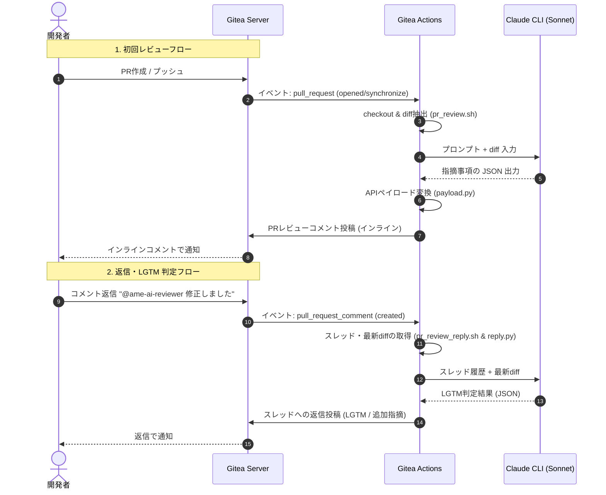

# アーキテクチャ解説

本 AI コードレビューシステムは、**Gitea Actions** と **Claude CLI (Sonnet)**
を組み合わせた軽量で拡張性の高いアーキテクチャを採用しています。

## 全体構成と処理の流れ

システムは主に2つのトリガー（PRの作成・更新と、スレッドへの返信）によって動作します。



---

## 各構成ファイルの役割

### 1. エントリポイント（シェルスクリプト）

- **`pr_review.sh`**
  PR 作成・更新時に起動。Git から変更されたファイルの差分 (diff) を抽出し、`review_prompt.txt`
  の内容と結合して Claude CLI を呼び出す。出力された指摘を `payload.py`
  に渡し、Gitea の API 経由でインラインレビューコメントを投稿する。
- **`pr_review_reply.sh`** 開発者からの返信コメントを検知して起動。`reply.py`
  を呼び出して返信が必要なスレッドを特定・プロンプトを構築し、Claude
  CLI を呼び出して LGTM か追加指摘かを判断する。結果をスレッドに返信する。

### 2. ビジネスロジック（Pythonスクリプト）

- **`payload.py`** Claude の JSON 出力をパースし、Gitea
  API 用のインラインコメント（new_position を含む）のペイロードへ変換する。diff 行番号と API コメント位置のマッピングも行う。
- **`reply.py`**
  Gitea の PR コメントスレッドを走査し、AI宛てメンションでAIが未返信のスレッドを特定する。また、会話履歴と最新の Git
  diff から、Claude 用の返信判定プロンプトを生成する。

---

## クライアントツール (Claude CLI) の動作原理

本システムでは、API を直接叩くコードを Python で書く代わりに、Anthropic が提供する `claude`
コマンドラインツールを Bash から呼び出しています。

```bash
claude -p \
    --model "${CLAUDE_MODEL:-sonnet}" \
    --max-budget-usd 2.00 \
    --output-format json \
    --dangerously-skip-permissions \
    < "$PROMPT_IN"
```

### なぜ Claude CLI を使用するのか？

1. **設定が極めてシンプル**: ランナー上で `claude auth`
   が通っていれば、複雑な API クライアントライブラリやトークンライフサイクル管理が不要になる。
2. **モデル設定が容易**: `--model "${CLAUDE_MODEL:-sonnet}"`
   オプション等で容易に使用するモデルを切り替えられる（環境変数 `CLAUDE_MODEL` で変更可能）。
3. **JSON出力サポート**: `--output-format json`
   を指定することで、信頼性の高い構造化データを得ることができる。
