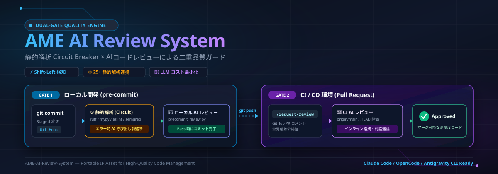

# AME AI Review System - Landing Page（兼 ドキュメントサイト）



本プロジェクトは、静的解析とAIレビューを組み合わせた「AME AI Review
System」のランディングページ兼**ドキュメントサイト**です。プロダクトの設計概要、Gate
1（ローカルコミット）および Gate
2（プルリクエスト）における二重の品質チェックフローをインタラクティブに体験・シミュレーションできます。

## ドキュメントサイトとしての構成

ランディングページは
**opencode.ai/docs/ja のようなドキュメントページ**として構成されています。左サイドバーのナビゲーションから、各ドキュメントページを閲覧できます。

| カテゴリ           | ページ                                                                       |
| ------------------ | ---------------------------------------------------------------------------- |
| **はじめに**       | 概要 / 主な機能 / 静的解析プリセット                                         |
| **使い方**         | インストールと初期設定 / Gate 1: pre-commit / Gate 2: PR レビュー / 動作デモ |
| **設定**           | config.json / 環境変数 / 設定ファイル例                                      |
| **アーキテクチャ** | システム構成 / Coding エージェント                                           |
| **サポート**       | トラブルシューティング                                                       |

- 各ページは `#/docs/<ページID>` のハッシュルーティングで直接リンクできる（例: `#/docs/gate1`）。
- ページ下部の前後ナビゲーションでドキュメントを順に読み進められる。
- 日本語（ja）/ 英語（en）の国際化、ダーク/ライト/システムテーマ、フォント、ポイントカラーに対応している。

## 技術スタック

- **フレームワーク**: React (v19)
- **言語**: TypeScript (型安全かつ厳格なコンパイラ設定)
- **ビルドツール**: Vite
- **スタイリング**: Tailwind CSS v4
- **ダイアグラム**: React Flow (@xyflow/react)
- **国際化 (i18n)**: 日本語 (ja) / 英語 (en) 対応とユーザー設定の永続化
- **テスト**: Vitest / Testing Library によるユニットテスト
- **リンター・フォーマッタ**: ESLint / Prettier / Stylelint / Oxlint

---

## 起動・開発手順

### 1. 依存関係のインストール

プロジェクトのルートディレクトリで実行し、必要なパッケージをすべてインストールします（npm
workspaces機能により、サブディレクトリの依存関係も解決されます）。

```bash
npm install
```

### 2. 開発用サーバーの起動

開発サーバーを起動して、ブラウザでリアルタイムにプレビューします。

```bash
# プロジェクトのルートディレクトリから実行する場合
npm run dev --workspace=landing-page

# または、landing-page ディレクトリに移動して実行する場合
cd landing-page
npm run dev
```

起動後、ターミナルに表示されるURL（標準では `http://localhost:5173`）にブラウザでアクセスします。

---

## 本番ビルドとプレビュー

### 1. ビルドの実行

本番環境向けの配布用アセットをビルドします。厳格な TypeScript 型検査（tsc）と Vite ビルドが実行されます。

```bash
# プロジェクトのルートディレクトリから実行する場合
npm run build --workspace=landing-page

# または、landing-page ディレクトリに移動して実行する場合
cd landing-page
npm run build
```

ビルド成果物は `landing-page/dist/` ディレクトリに生成されます。

### 2. ビルド成果物のプレビュー

ローカル環境で本番用ビルドの表示・動作テストを行います。

```bash
# プロジェクトのルートディレクトリから実行する場合
npm run preview --workspace=landing-page

# または、landing-page ディレクトリに移動して実行する場合
cd landing-page
npm run preview
```

起動後、ブラウザで `http://localhost:4173` を開いて動作を確認します。

---

## GitHub Pages へのデプロイ

本ランディングページは GitHub Pages で公開されています。

- **公開URL**: <https://tarminjapan.github.io/AME-AI-Review-System/>
- **デプロイワークフロー**: `.github/workflows/deploy-landing-page.yml`

### デプロイの仕組み

main ブランチに push されると、`deploy-landing-page`
ワークフローが自動的に landing-page をビルドします。そして GitHub
Pages 環境にデプロイします。GitHub 公式の Pages Actions を使用した標準構成です。

- `actions/configure-pages`
- `actions/upload-pages-artifact`
- `actions/deploy-pages`

GitHub Pages はプロジェクトサイトとして公開されます。そのため本番ビルド時は base
path にリポジトリ名 (`/AME-AI-Review-System/`) が付与されます。この設定は `vite.config.ts` の `base`
オプションで、ビルド時 (`command === "build"`) のみ適用されます。開発サーバー (`vite dev`) とテスト (`vitest`) ではルート
`/` を使用します。

### Pages の有効化（初回のみ）

リポジトリの `Settings > Pages > Build and deployment` の `Source` を **GitHub Actions**
に設定してください。ワークフローが自動デプロイを担当します。

### 手動デプロイ

GitHub リポジトリの `Actions` タブから `Deploy Landing Page`
ワークフローを選択します。`Run workflow`
で任意のタイミングに手動デプロイできます (`workflow_dispatch`)。

---

## テストの実行

Vitest によるユニットテストを実行します。

```bash
# プロジェクトのルートディレクトリから実行する場合
npm test

# または、landing-page ディレクトリに移動して実行する場合
cd landing-page
npm run test
```

---

## ドキュメント内容とソースコードの整合性

サイト内のドキュメント（機能・コマンド・設定キー・環境変数など）は、ソースコード (`ame_ai_review_system/`) の実装に基づいて記載されています。実装を変更した場合は、
`landing-page/src/docs.tsx` および `landing-page/src/i18n.ts` の内容もあわせて更新してください。

- ドキュメントページの本文: `landing-page/src/docs.tsx`
- サイドバーナビゲーション: `landing-page/src/docsNav.ts`
- 翻訳リソース（ja / en）: `landing-page/src/i18n.ts`
- 共通コンポーネント（静的解析・エンジン比較・シミュレーター等）: `landing-page/src/components.tsx`
